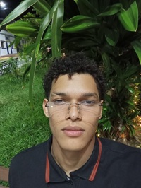

  

###

  

###

<h1 align="center">Bem vindo!👋</h1>

###

<h3 align="left">👩‍💻  Sobre mim</h3>

###

- 🔭 Estudante de Matemática Computacional - 6° semestre - UFCA. - 📚 Entusiasta em desenvolvimento desktop - ⚡ em meu tempo livre gosto de aprender coisas novas - 🔬 Interesse em ciência de dados

###

<h3 align="left">🛠 Linguagens e ferramentas</h3>

###

  
  
  
  
  
  
  
  
  

###

###

  
  
  

###
